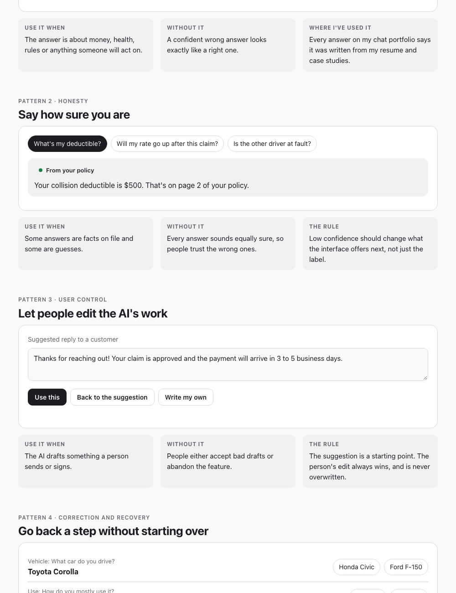

# AI UX patterns

Seven interface patterns for AI products people can trust, each with a working demo, when to use it, and what goes wrong without it.

<picture>
  <source media="(prefers-color-scheme: dark)" srcset="assets/patterns-dark.png">
  
</picture>

**[Try the demos](https://miguelclavel.github.io/ai-ux-patterns/)** · one file, no libraries. The demos are scripted, so there's no model behind them: the point is the interface, not the AI.

| # | Pattern | The principle | The one line rule |
| --- | --- | --- | --- |
| 1 | **Show your sources** | Transparency | Anything someone will act on links to where it came from |
| 2 | **Say how sure you are** | Honesty | Low confidence changes what's offered next, not just the label |
| 3 | **Let people edit the AI's work** | User control | The suggestion is a starting point; the person's edit always wins |
| 4 | **Go back a step without starting over** | Correction and recovery | Change one answer, keep the rest |
| 5 | **Say why you're asking** | Trust | Personal or regulated questions explain themselves where they're asked |
| 6 | **Say what it can't do, and hand off well** | Clear boundaries | A boundary always comes with a next step, and the context travels |
| 7 | **Show exactly what will happen, before it happens** | Human oversight | Before an agent sends, pays, books or deletes, show the exact result |

## Why these seven

I design AI products around six principles: human oversight, user control, transparency, correction and recovery, predictable outcomes, and clear boundaries. Each pattern here is one of those turned into something you can click.

They matter most where getting it wrong costs someone real money or real time, which is where I work: insurance, credit cards and loans. The demos use an insurance claim as the example for that reason.

## Where these come from

Some of these are in work I've shipped or built:

- **Go back a step** and **say why you're asking**: the [conversational insurance quote](https://miguelclavel.com/work/auto-insurance-conversational-flow?utm_source=github&utm_medium=ai-ux-patterns) I designed keeps every answer editable at every stage and asks for consent at the point of collection.
- **Show your sources**: every answer on [my chat portfolio](https://github.com/miguelclavel/chat-portfolio) says it was written from my resume and case studies.
- **Review before acting**: the paint tool on my second portfolio shows your message, name and email before anything is sent.

The rest are how I'd design them for an AI product. All seven demos are concepts, with scripted content and made up sample data.

## Use them

Each pattern is a self contained block in `index.html`: the markup in its `<section>`, a few lines of CSS, and a few lines in the script at the bottom. Copy the one you need. More on designing with AI in my [product design playbook](https://github.com/miguelclavel/product-design-playbook).

---

MIT licensed. Made by [Miguel Clavel](https://miguelclavel.com/?utm_source=github&utm_medium=ai-ux-patterns) with Claude Code.
